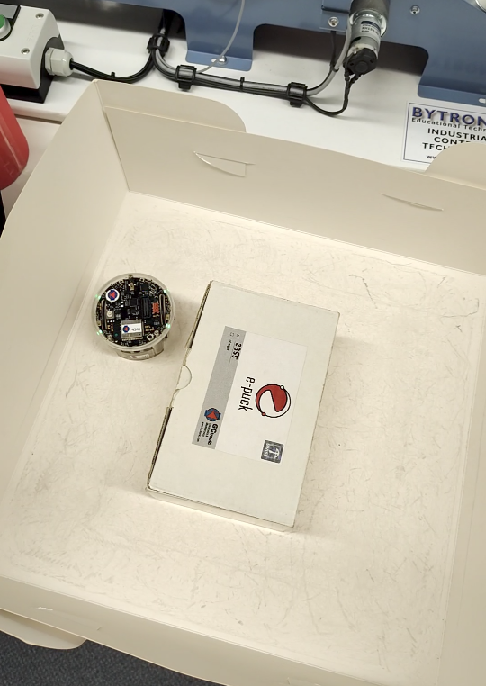

# e-puck2 navigation

This project is based on the e-puck2 robot.
It involves autonomously navigating in a confined environment and tracking a designated object using Time-of-Flight (ToF) and infrared proximity sensors.

##nRequirements

A special version of [Eclipse](https://tinyurl.com/UoS-epuck2), preconfigured to work with the e-puck2 was used to build the project along with the e-puck2 [source code](https://github.com/e-puck2/e-puck2_main-processor.git).